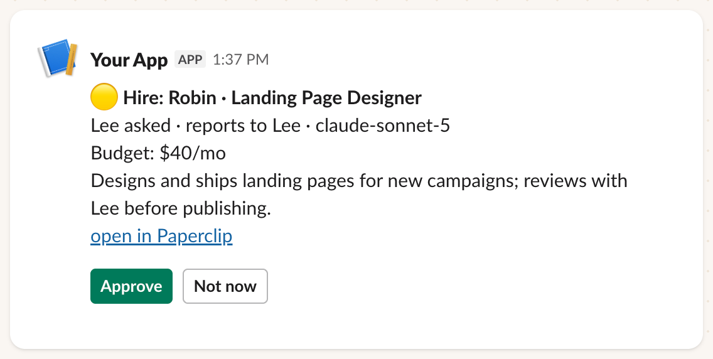
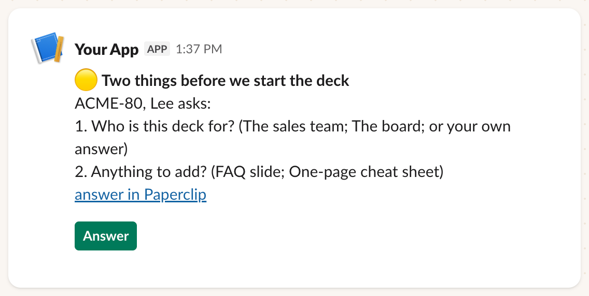
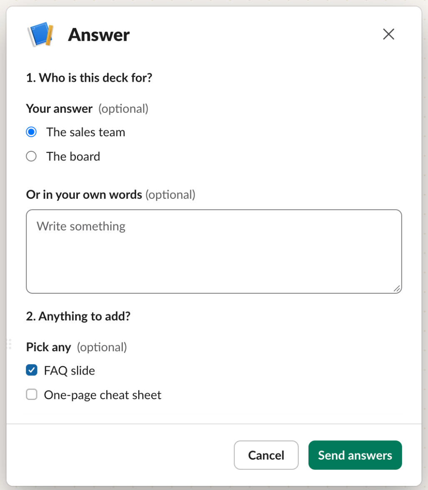
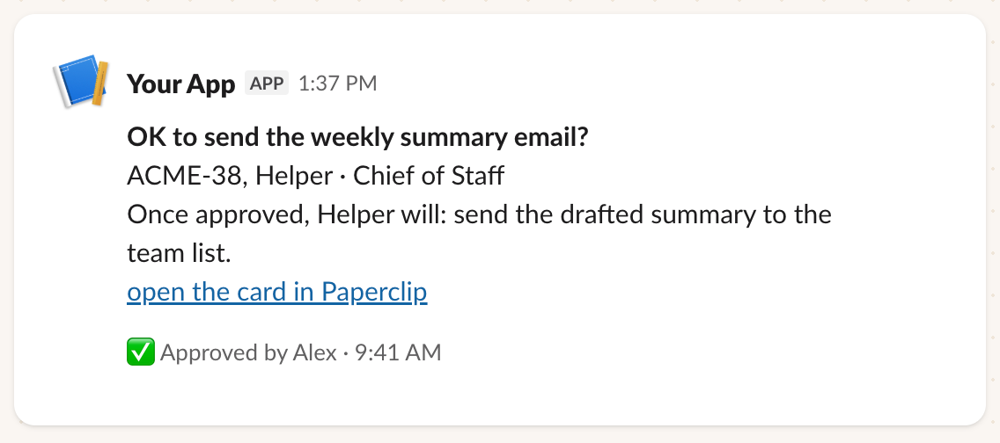

# paperclip-approvals

Approve [Paperclip](https://github.com/paperclipai/paperclip) work from Slack or Telegram: hires,
budgets, strategy decisions, confirmation cards, and questions your agents ask you. One Python file,
no AI in it, and nothing listening on the internet.

```
Paperclip ──(poll every 20 s, read-only key)──▶ bot ──▶ Slack channel / Telegram DM
    ▲                                                        │
    └──(decision made with the approver's own key)◀── button press or answer form
```

## What it looks like

An agent asks to hire someone. Anyone on the approver list can decide from Slack:



An agent has questions. **Answer** opens a form with its choices, and the answers go back to Paperclip:





Once decided, the message says who decided and the buttons go away:



<sub>Rendered from the bot's own message code with example data, using Slack's Block Kit Builder. In
your workspace the sender shows as your app's name instead of "Your App".</sub>

## Why

Paperclip's built-in chat connectors are webhook-based, so Paperclip needs a public HTTPS address.
Board approvals (hires, budgets, strategy) don't reach chat at all, and only simple OK cards on tasks
started in that chat get buttons. If your Paperclip runs on a home server or behind a VPN, approvals
wait until you open the dashboard.

This bot makes outbound connections only (Slack Socket Mode or Telegram long polling). It posts
every item waiting on a person, and records the decision in Paperclip as that person.

## Safety model

The bot is built so that nothing it reads can steer it.

- **No AI.** It's plain code. No model reads your chat or Paperclip's text, so there's nothing to
  prompt-inject.
- **Each decision uses the approver's own Paperclip key.** Paperclip records the approval as that
  person, and its own rules still apply: human-only cards stay human-only, and permissions are
  Paperclip's, not the bot's. The bot's shared key is only used to list what's pending.
- **Re-checked before acting.** On every press the item is fetched again and must still be pending.
  A decision already made in the Paperclip UI can't be overwritten from chat; the message updates
  to "Handled in Paperclip." instead.
- **Approvers are a fixed list.** A press counts only from a listed Telegram or Slack user ID, and
  only for the kinds of item that person may decide (`board`, `card`, or both). Everyone else gets a
  private "only an approver can decide this", and the refusal is logged.
- **It doesn't read conversation.** On Telegram it ignores typed text except `/start` in a private
  chat (which replies with your ID for setup). On Slack the app has only `chat:write`, no event
  subscriptions, and sees only its own buttons and forms.
- **Outbound only.** No webhook, no open port, no public URL.
- **Fails closed.** Any error leaves the item pending in Paperclip, with a private note to the
  presser.
- **Audit log.** Every decision, answer and refusal is a JSON line in the audit file.
- **Secrets stay out of logs.** Keys come from environment files, aren't printed, and the Telegram
  token is redacted from error messages.

## What it handles

| Paperclip item | In chat |
|---|---|
| Board approvals: hire, budget override, CEO strategy, board decision | Message with **Approve** / **Not now** |
| Confirmation cards (`request_confirmation`) on any open task | Message with **Approve** / **Not now** (a decline reason is sent where the card requires one) |
| Question cards (`ask_user_questions`) | Slack: an **Answer** button opens a form with each question as radio buttons, checkboxes or a menu, plus a free-text box where the card allows it. Telegram: the questions with a link to answer in Paperclip. |

Messages edit themselves once decided ("✅ Approved by Alex · 9:41 PM", "Not now · Alex", "✅ Answered
by Alex: …", or "Handled in Paperclip.") and drop their buttons.

## Alternatives

The community plugins [paperclip-plugin-slack](https://github.com/mvanhorn/paperclip-plugin-slack)
and [paperclip-plugin-telegram](https://github.com/mvanhorn/paperclip-plugin-telegram) are full chat
integrations that run inside Paperclip: notifications, bot commands, agent threads, workflows, and
Approve/Reject buttons for approvals and confirmation cards. If you want chat to be a command center
for your agents, use those.

This bot is deliberately narrower:

- approvals and questions only, with no commands, so there's less to secure;
- a separate process outside Paperclip, using only outbound connections;
- every decision made with the presser's own Paperclip key, rather than one shared token;
- every press re-checked against Paperclip before acting;
- answer forms for agents' question cards (`ask_user_questions`).

## Requirements

- Python 3.11 or newer.
- Slack mode: `slack_sdk` (`pip install -r requirements.txt`). Telegram mode needs only the standard
  library.
- A Paperclip **board API key** for listing pending items, and one Paperclip key per approver (a
  board key belonging to that person).
- Tested with Paperclip **2026.916.1** (self-hosted). It uses Paperclip's REST API, including some
  routes that aren't formally documented, so a Paperclip upgrade can break it. Check the tests and
  the "Paperclip API used" section below after upgrading.

## Setup

```bash
git clone https://github.com/sthreelabs/paperclip-approvals && cd paperclip-approvals
python3 -m venv .venv && .venv/bin/pip install -r requirements.txt
cp config.example.env config.env          # edit: Paperclip URL, company ID, chat mode
cp approvers.example.json approvers.json  # edit: who may decide what
```

**Secrets file** (`secrets.env`, mode 600). Enter values without echoing them:

```bash
read -rs BOARD && printf 'PAPERCLIP_BOARD_KEY=%s\n' "$BOARD" > secrets.env && chmod 600 secrets.env; unset BOARD
```

Add each approver's key under the name their `key_env` points to, plus the chat tokens below.

**Approvers** (`approvers.json`):

```json
[
  {"name": "Alex", "slack_user_id": "U0123ABCD", "key_env": "PAPERCLIP_KEY_ALEX", "kinds": ["board", "card"]},
  {"name": "Sam", "slack_user_id": "U0456EFGH", "key_env": "PAPERCLIP_KEY_SAM", "kinds": ["card"]}
]
```

Use `telegram_id` instead of `slack_user_id` for Telegram mode. Items no listed approver may decide
are never posted.

### Slack

1. Create the app from `deploy/slack-app-manifest.yaml` (api.slack.com/apps > Create New App > From
   a manifest) and install it to your workspace. The **Bot User OAuth Token** (`xoxb-…`) is
   `SLACK_BOT_TOKEN`.
2. Under Basic Information > App-Level Tokens, create one with `connections:write`. That's
   `SLACK_APP_TOKEN` (`xapp-…`).
3. Invite the app to your approvals channel and put the channel ID in `SLACK_APPROVALS_CHANNEL`.
4. Put both tokens in `secrets.env`.

### Telegram

1. Create a bot with @BotFather and put its token in `secrets.env` as `TELEGRAM_BOT_TOKEN`.
2. Set `APPROVALS_CHAT=telegram` in `config.env`.
3. Each approver sends the bot `/start` to get their Telegram ID for `approvers.json`.

## Run

```bash
.venv/bin/python approvals.py --env-file secrets.env --env-file config.env --once   # one pass, to check setup
.venv/bin/python approvals.py --env-file secrets.env --env-file config.env          # run
```

To keep it running, use `deploy/paperclip-approvals.service` (systemd) or
`deploy/com.example.paperclip-approvals.plist` (macOS launchd). Several Paperclip companies can share
one Slack channel: run one bot per company, each with its own Slack app, and set `APPROVALS_LABEL`
so every message says whose it is.

All settings are listed in the docstring at the top of `approvals.py`.

## Paperclip API used

| Purpose | Route |
|---|---|
| List pending board approvals | `GET /api/companies/:id/approvals?status=pending` |
| List open issues and their cards | `GET /api/companies/:id/issues?status=…`, `GET /api/issues/:id/interactions` |
| Decide a board approval | `POST /api/approvals/:id/approve` · `/reject` |
| Decide a confirmation card | `POST /api/issues/:id/interactions/:cardId/accept` · `/reject` |
| Answer a question card | `POST /api/issues/:id/interactions/:cardId/respond` |
| Clear a decided approval from the approver's inbox | `POST /api/companies/:id/inbox-dismissals` |

## Tests

```bash
.venv/bin/pip install pytest && .venv/bin/python -m pytest -q
```

The tests use fake Paperclip, Slack and Telegram clients; they make no network calls.

## Status

Provided as-is under the MIT license. It runs in production for its authors, and fixes are made
when they need them. Issues and pull requests are welcome, but there's no promise of support or of
keeping up with every Paperclip release.

A community tool, not affiliated with or endorsed by Paperclip. "Paperclip" refers to the
open-source project at [paperclipai/paperclip](https://github.com/paperclipai/paperclip).

Made by [sthreelabs](https://sthreelabs.com), a small studio that builds AI teams for small businesses.
